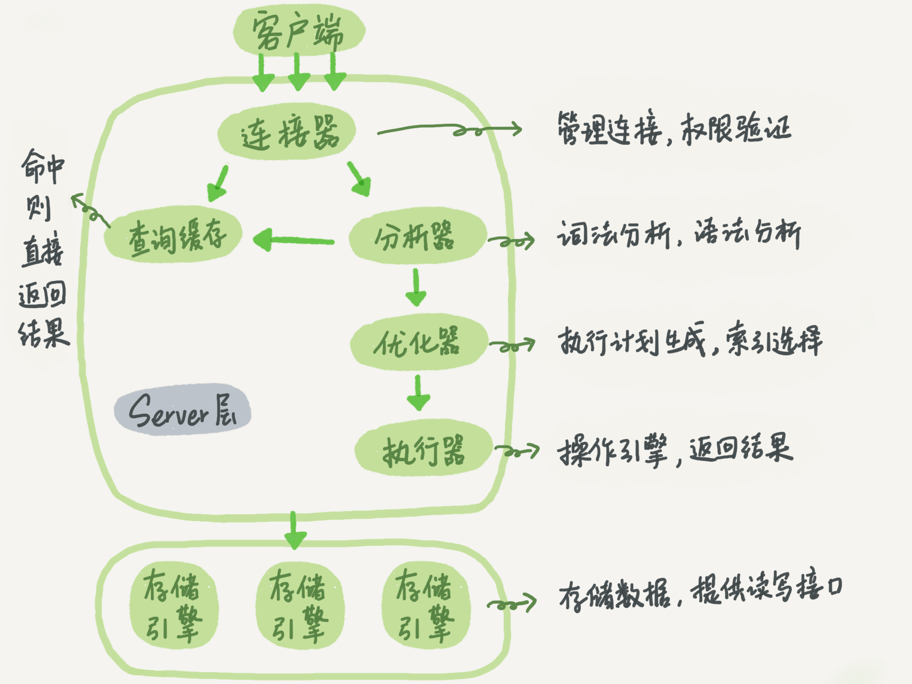

# 01 基础架构：一条SQL查询语句是如何执行的？

当然！我们这就把这篇关于 MySQL 基础架构的文章，也变成一个生动有趣的故事。

想象一下，你不是在执行一条 SQL 语句，而是在**一家超大型的、分工明确的“MySQL 餐厅”里点了一份菜**。你的点餐单就是那条 SQL 语句：`select * from T where ID=10;`

我们来看看，从你下单到菜品上桌，这张点餐单都经历了什么。

### 餐厅的总体结构

首先，这家“MySQL 餐厅”分为两个核心区域：

1. **楼面 + 后厨 (Server 层)**：这是餐厅的大脑和指挥中心，包括了门口的接待、传菜员、订单分析师、总厨、执行厨师等。所有客人的通用服务都在这一层完成。

2. **储藏室 (存储引擎层)**：这里是真正存放食材（数据）的地方。而且餐厅有很多不同类型的储藏室，比如最常用的 `InnoDB` 储藏室（控温、带锁、管理严格），还有 `MyISAM` 储藏室（存取简单快速但不带锁），`Memory` 储藏室（临时冰柜，断电后食材就没了）等等。

好，现在你走进了餐厅，点餐之旅正式开始！

* * *

### 第一站：餐厅门口的接待员 (连接器)

你首先得能走进餐厅大门。门口的**接待员 (Connector)** 会拦住你，做几件事：

* **身份验证**：他会问你要“用户名和密码”。如果你说错了，他会冷冷地告诉你“Access denied for user”，然后把你拒之门外。

* **权限检查**：验证通过后，他会拿出一个小本本，查一下你的“会员等级”（权限），看看你在这家餐厅里能点哪些菜，不能点哪些菜。这个权限在你这次进门时就已经定好了，即使你在用餐途中，餐厅经理给你升级了会员，你这次用餐的权限也不会变，除非你出去再重新进来一次。

* **分配座位**：他会给你安排一个座位（一个连接）。如果你光坐着不点菜（连接空闲），时间太久（默认8小时），接待员会认为你已经离开了，就会把这个座位清空（断开连接），这就是 `wait_timeout`。

**餐厅小贴士**：反复进出大门（建立连接）很麻烦，所以最好能一直坐在座位上点菜（使用长连接）。但如果你在一个座位上堆积了太多餐盘和垃圾（临时内存），可能会把桌子压垮（内存溢出），导致餐厅把你请出去（MySQL 异常重启）。所以，要么吃几道大菜后就换个座位（定期断开重连），要么在吃完一道大菜后，请服务员把桌子彻底清理干净（`mysql_reset_connection`）。

### 第二站：记性超好的传菜员 (查询缓存)

你坐下后，一个**记性超好的传菜员 (Query Cache)** 跑了过来。他没有直接把你的点餐单送去后厨，而是看了一眼，然后在大脑里飞速搜索：“这位客人，是不是刚刚点过一模一样、连特殊要求都分毫不差的菜？”

* **如果点过 (命中缓存)**：他会神奇地从旁边的一个保温柜里，直接端出这道一模一样的菜给你。速度极快！

* **如果没点过**：他才会把点餐单送往后厨。等后厨把菜做好后，他会顺手在保温柜里也放一份，以备下次。

为什么这个传菜员后来被开除了？

因为他太“敏感”了。只要后厨对某个菜的任何一个食材（表里的任何数据）做了哪怕一丁点的改动（UPDATE），这个传菜员为了保证不出错，就会把保温柜里所有用到这个食材的菜全部扔掉！这导致他的工作效率（命中率）极低，保温柜里的菜刚放进去就得扔，反而碍事。所以在 MySQL 8.0 这家餐厅，就直接把他给开除了。

### 第三站：订单分析师 (分析器)

点餐单终于来到了后厨，交到了**订单分析师 (Analyzer)** 手里。他需要搞清楚你到底想吃什么。

1. **“切词” (词法分析)**：他会把你的点餐单 `select * from T where ID=10;` 拆成一个一个的词：`select` 是一个动作（“查询”），`T` 是一个菜名（“表名”），`ID` 是一个要求（“列名”）……

2. **“审稿” (语法分析)**：他会根据餐厅的“菜单语法”来判断你写的这句话通不通顺。如果你写的是 `elect * from T`（少了个s），他就会把订单退回来，并附上纸条：“语法错误，请检查‘use near’后面的部分”。

### 第四站：总厨 (优化器)

分析师搞懂了订单内容，现在交给了**总厨 (Optimizer)**。总厨不负责炒菜，他负责**决定这道菜怎么做才最高效**。

比如，一份“西红柿炒鸡蛋”，是先炒西红柿，还是先炒鸡蛋？一份“多宝鱼”，是清蒸还是红烧？

对于你的订单，如果 `T` 这道菜里有很多种食材（多个索引），总厨会决定用哪个食材作为主料（使用哪个索引）会更快。如果你的订单是“关联查询”（join），他会决定先处理哪张菜单（先驱动哪个表）效率更高。

总厨深思熟虑后，制定出一套**“最佳烹饪方案”**，然后交给下面的厨师。

### 第五站：执行厨师 (执行器)

**执行厨师 (Executor)** 拿到了总厨的“烹饪方案”，开始动手做菜。

1. **再次确认权限**：动手前，他会再确认一下，你点的这道菜 `T` 是不是在你的可点菜单范围内（有没有查询权限）。没有？直接返回“没有权限”的错误。

2. **动手操作**：
   
   * 他根据烹饪方案，走到指定的**储藏室 (`InnoDB` 等)** 门口，喊道：“开门！”
   
   * 然后按照方案去拿食材。如果方案说 `ID` 字段没有索引，那他就只能把储藏室里所有 `T` 相关的食材（表里的每一行）都拿出来看一遍，判断 `ID` 是不是 10。
   
   * 他把所有满足 `ID=10` 的食材都挑出来，放在一个大盘子里（结果集）。

### 最后一站：上菜

执行厨师把装满食材的大盘子（结果集）递给服务员，服务员最终把它端到你的面前。至此，一次完整的“点餐”过程就结束了。

#### 关于文章末尾的问题

> 如果表 T 中没有字段 k，而你执行了 `select * from T where k=1`，这个错误在哪一站报出来？

答案是：在**第三站，订单分析师 (Analyzer)** 那里。

当分析师在“审稿”（语法分析）时，他会去核对餐厅的官方菜单（数据字典），看看 `T` 这道菜里到底有没有 `k` 这个配料。当他发现菜单上根本没有 `k` 时，他就会立刻报错：“Unknown column ‘k’ in ‘where clause’”（在‘where’条件里发现未知配料‘k’），订单直接被退回，根本不会流转到总厨和执行厨师那里。
